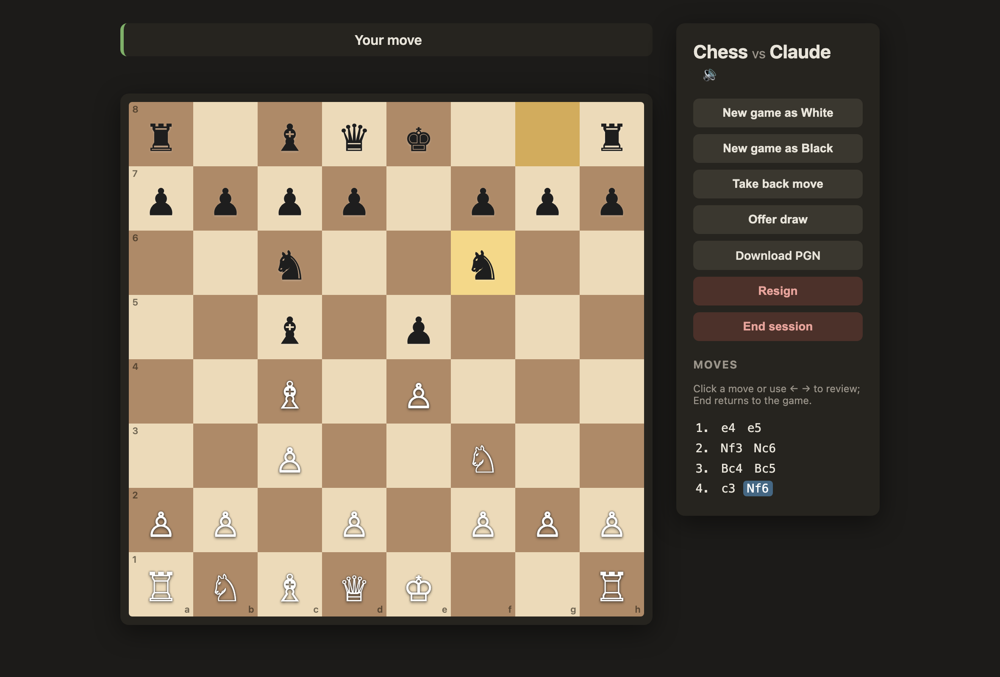
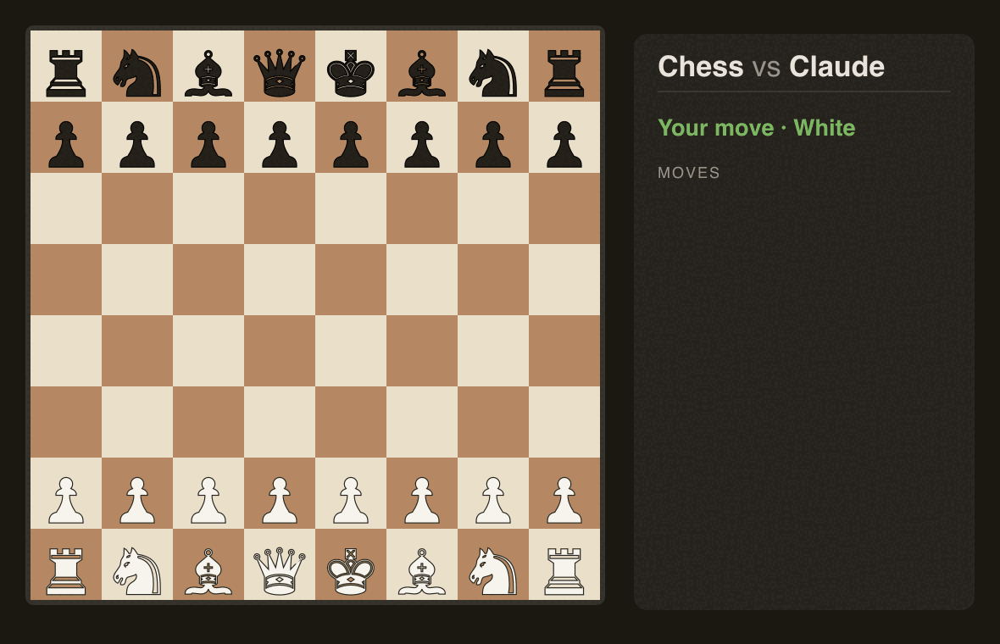
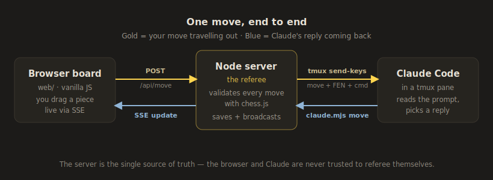

# Chess with Claude

Play chess in your browser against a live Claude Code session. A local Node
server referees — it validates every move with chess.js, serves the board, and
holds the game state — while Claude plays the other side: it thinks about the
position, tells you what it played and why, and offers or accepts draws on the
merits. It runs entirely on your machine, and it is meant as a break inside a
normal Claude session, not a standalone chess site.

<p align="center">
  
</p>
<p align="center"><em>You play in the browser; Claude answers from its terminal.</em></p>

<p align="center">
  
</p>

## Quick start

```bash
npx claude-chess
```

Fetches the package, starts the referee server, opens the board at
<http://localhost:3456>, and prints the command your agent runs to play the
other side. `npx claude-chess stop` stops it; `status` and `doctor` report
what is running and check your setup; add `--no-open` to skip opening the
browser.

To hack on it, clone instead:

```bash
git clone https://github.com/santiagoogaitnas/claude-chess.git
cd claude-chess
npm run setup        # check Node, tmux, deps; install what's missing
npm start            # start the server and open the board
```

Node 18+ is the only requirement. The one dependency, chess.js, installs
automatically on first run.

## Playing

Inside a Claude Code session, say `/chess`. Claude starts the server, opens the
board, and plays you — you move in the browser, it answers in the terminal and
tells you what it played. Say "stop" when you are done. `/chess` loads
automatically when you launch Claude inside this repo; run
`chess-app/bin/install-skill` once to use it from any session.

Any terminal agent can play without the skill. Start a server (`npx
claude-chess`), then loop the CLI:

```bash
node chess-app/server/claude.mjs wait   # block until your turn / a draw offer / game over
node chess-app/server/claude.mjs move Nf6
```

`wait` long-polls the server and prints why it returned — `your-turn`,
`draw-offer`, or `game-over`. Reply with `move`, `draw accept|decline`, or
`resign`, then wait again. That loop is the whole contract, written up under
"Being the opponent" in [the API doc](chess-app/server/API.md); it works with
or without tmux, and with Claude, Codex, or Gemini driving it.

## How it works

Three parts: the browser board is your side, the Node server is the referee
(validates with chess.js, owns the game state, persists it to disk), and the
agent is your opponent. The human's move reaches the agent over one of two
interchangeable transports. With tmux the server types the move straight into
the agent's pane, so the chat stays free between moves — the preferred path
when you launch inside tmux. Without it the agent pulls: it long-polls `GET
/api/wait` until the server says the move is owed. Same server, same game; only
the delivery differs.

<p align="center">
  
</p>
<p align="center"><em>The tmux push path — your move out in gold, Claude's reply back in blue. Without tmux the agent pulls the same move from <code>/api/wait</code>.</em></p>

## Development

`npm test` runs the server regression suite plus the
api/cli/ctl/pull-loop/tmux/web end-to-end suites; each spawns a real server on
a throwaway port. Run it in
isolation — overlapping runs cause port flakiness, not real failures.
`ARCHITECTURE.md` covers the design and `chess-app/server/API.md` is the wire
contract, including the `/api/wait` long-poll and the agent loop. Read
`CONTRIBUTING.md` before opening a pull request.

## License

Released under the [MIT License](LICENSE).
